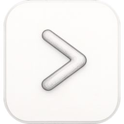

<p align="center">
  
</p>

<h1 align="center">My Bar</h1>

<p align="center">English · <a href="README.ko.md">한국어</a></p>

Hide menu bar icons on macOS. Icons dragged (⌘-drag) to the left of the
separator are hidden when collapsed; click the main icon or press your
toggle shortcut to show/hide. Inspired by Hidden Bar.

- No special permissions required (no Accessibility, no Screen Recording)
- Auto-rehide after a configurable delay
- Optional "always hidden" section (reveal with ⌥-click)
- Self-updating from GitHub Releases

## Install

1. Download the latest zip from [Releases](https://github.com/DevooKim/my-bar/releases/latest) and unzip.
2. Move `My Bar.app` to Applications and open it.
3. The app is self-signed: on first launch, allow it via
   System Settings > Privacy & Security > "Open Anyway".

## Usage

- **⌘-drag** menu bar icons across the `|` separator to choose what gets hidden.
- **Click** the main icon (❮/❯) or press your **toggle shortcut** to expand/collapse. Set the shortcut in Settings → General.
- **Right-click** the main icon for the menu (settings, update, quit).
- **⌥-click** to also reveal the always-hidden section (enable it in Settings).

## Development

```sh
make build    # debug build
make test     # unit tests
make run      # bundle and launch dist/My Bar.app
make publish  # tag + GitHub release (bump version first: make bump-patch)
```

## License

MIT
